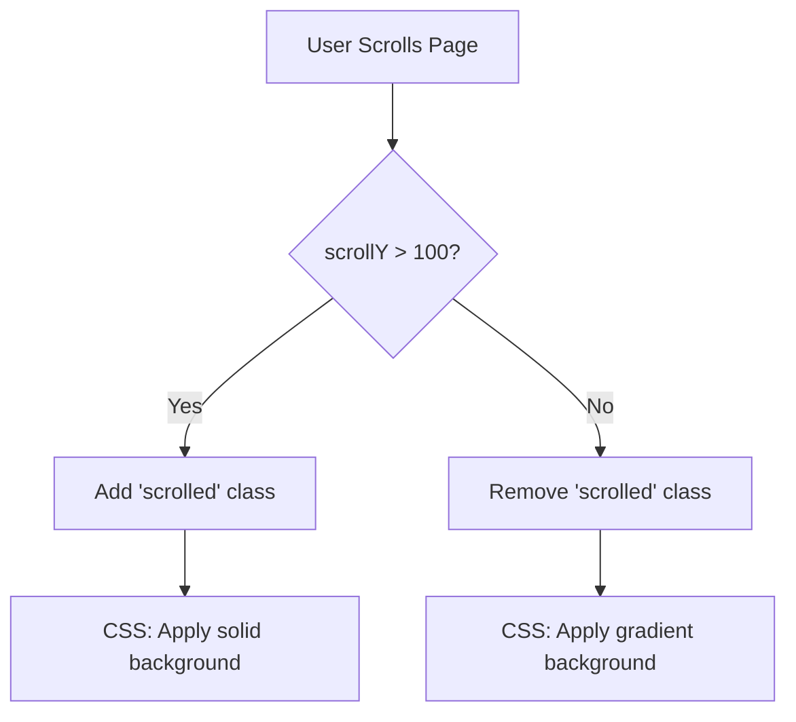
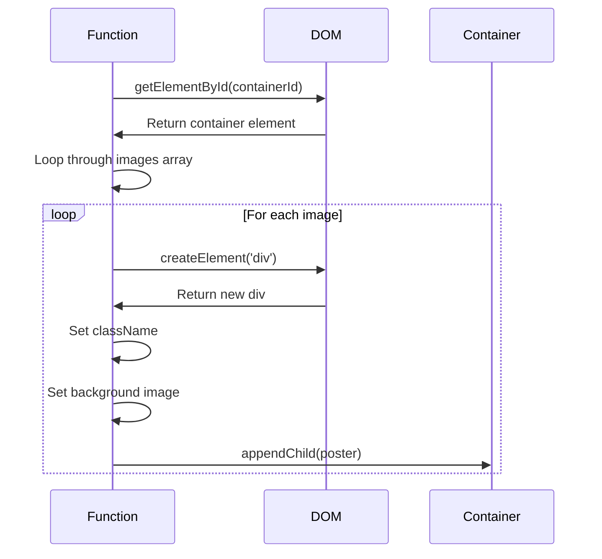
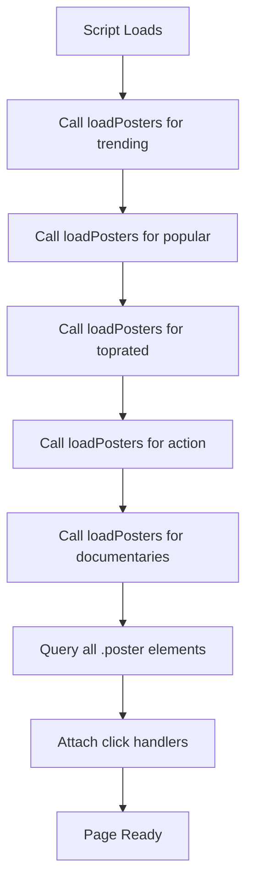
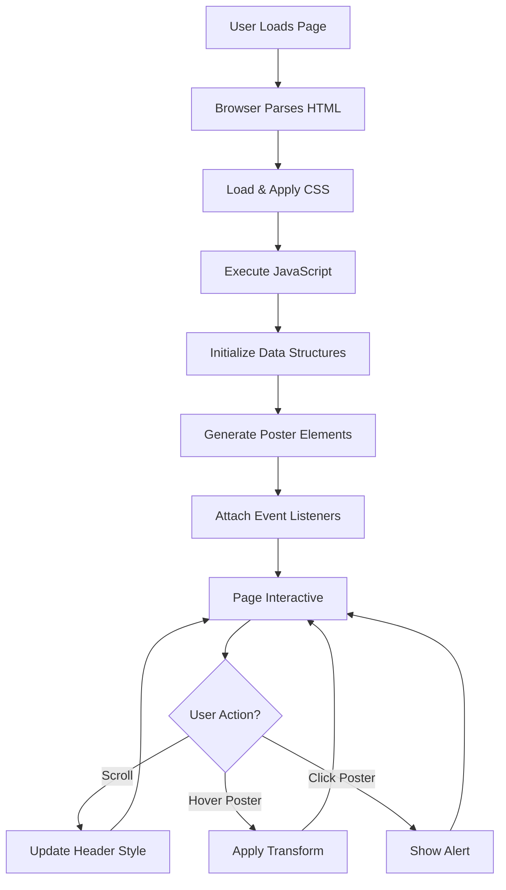

# 📖 Netflix Clone - Technical Documentation

<div align="center">


</div>

---

## 📑 Table of Contents

1. [Architecture Overview](#architecture-overview)
2. [HTML Structure Deep Dive](#html-structure-deep-dive)
3. [CSS Architecture](#css-architecture)
4. [JavaScript Modules](#javascript-modules)
5. [Data Flow](#data-flow)
6. [Event Handling](#event-handling)
7. [Performance Optimization](#performance-optimization)
8. [Best Practices](#best-practices)

---

## 🏗️ Architecture Overview

### System Architecture

```
┌─────────────────────────────────────────────────────────────┐
│                         USER BROWSER                         │
│                                                               │
│  ┌───────────────────────────────────────────────────────┐  │
│  │                    HTML (index.html)                   │  │
│  │  • Semantic Structure                                  │  │
│  │  • Accessibility Features                              │  │
│  │  • SEO Optimization                                    │  │
│  └────────────────────┬──────────────────────────────────┘  │
│                       │                                      │
│  ┌────────────────────┴──────────────────┐                  │
│  │                                        │                  │
│  ▼                                        ▼                  │
│  ┌────────────────────┐      ┌───────────────────────────┐  │
│  │   CSS (style.css)  │      │   JavaScript (script.js)  │  │
│  │  • Layout          │      │  • DOM Manipulation       │  │
│  │  • Animations      │      │  • Event Handling         │  │
│  │  • Responsiveness  │      │  • Dynamic Content        │  │
│  └────────────────────┘      └───────────────────────────┘  │
│           │                              │                   │
│           └──────────────┬───────────────┘                   │
│                          ▼                                   │
│              ┌────────────────────────┐                      │
│              │   External Resources   │                      │
│              │  • Unsplash API        │                      │
│              │  • Web Fonts           │                      │
│              └────────────────────────┘                      │
└─────────────────────────────────────────────────────────────┘
```

### Technology Stack Breakdown

| Layer | Technology | Purpose | Lines of Code |
|-------|------------|---------|---------------|
| **Structure** | HTML5 | Semantic markup and content organization | ~100 |
| **Presentation** | CSS3 | Styling, layout, and visual effects | ~200 |
| **Behavior** | JavaScript ES6+ | Interactivity and dynamic content | ~100 |
| **Assets** | Unsplash API | High-quality movie poster images | N/A |

---

## 🌐 HTML Structure Deep Dive

### Document Structure

```html
<!DOCTYPE html>
<html lang="en">
  <head>
    <!-- Meta Information -->
  </head>
  <body>
    <!-- Header Navigation -->
    <!-- Hero Banner -->
    <!-- Content Rows -->
    <!-- Footer -->
    <!-- Scripts -->
  </body>
</html>
```

### Section 1: Document Head

```html
<head>
    <meta charset="UTF-8">
    <meta name="viewport" content="width=device-width, initial-scale=1.0">
    <title>Netflix Clone</title>
    <link rel="stylesheet" href="style.css">
</head>
```

#### Detailed Breakdown

| Element | Purpose | Technical Details |
|---------|---------|-------------------|
| `charset="UTF-8"` | Character encoding | Supports international characters and emojis |
| `viewport` meta | Mobile responsiveness | Ensures proper rendering on mobile devices |
| `<title>` | Page title | Displays in browser tab and search results |
| `<link>` | External CSS | Separates styling from structure |

**Why This Matters:**
- UTF-8 encoding ensures all characters display correctly worldwide
- Viewport meta tag is critical for mobile responsiveness
- External CSS improves maintainability and caching

---

### Section 2: Header Component

```html
<header id="header">
    <div class="logo">NETFLIX</div>
    <nav>
        <ul>
            <li><a href="#">Home</a></li>
            <li><a href="#">TV Shows</a></li>
            <li><a href="#">Movies</a></li>
            <li><a href="#">New & Popular</a></li>
            <li><a href="#">My List</a></li>
        </ul>
    </nav>
    <div class="nav-right">
        <div class="search">🔍</div>
        <div class="notifications">🔔</div>
        <div class="profile">👤</div>
    </div>
</header>
```

#### Component Analysis

**Structure Pattern:**
```
header (container)
├── logo (brand identity)
├── nav (main navigation)
│   └── ul > li > a (menu items)
└── nav-right (user actions)
    ├── search
    ├── notifications
    └── profile
```

**Technical Specifications:**

| Element | Role | Attributes | Styling Hook |
|---------|------|------------|--------------|
| `<header>` | Semantic container | `id="header"` | Fixed positioning |
| `.logo` | Brand identity | - | Netflix red color |
| `<nav>` | Navigation landmark | - | Flex container |
| `.nav-right` | User controls | - | Right-aligned flex |

**Semantic HTML Benefits:**
1. **Accessibility**: Screen readers identify navigation structure
2. **SEO**: Search engines understand page hierarchy
3. **Maintainability**: Clear purpose of each section

---

### Section 3: Hero Banner

```html
<section class="hero">
    <div class="hero-content">
        <h1 class="hero-title">Stranger Things</h1>
        <p class="hero-description">
            When a young boy vanishes, a small town uncovers a mystery 
            involving secret experiments, terrifying supernatural forces 
            and one strange little girl.
        </p>
        <div class="hero-buttons">
            <button class="btn btn-play">▶ Play</button>
            <button class="btn btn-info">ℹ More Info</button>
        </div>
    </div>
</section>
```

#### Design Patterns

**Visual Hierarchy:**
```
1. Title (h1) - Largest, most prominent
   ↓
2. Description (p) - Supporting information
   ↓
3. Action Buttons - Call to action
```

**Component Breakdown:**

| Element | Purpose | Styling | Interaction |
|---------|---------|---------|-------------|
| `.hero` | Full-width container | Background image + gradient | Static |
| `.hero-content` | Content wrapper | Max-width constraint | None |
| `.hero-title` | Main heading | 48px bold font | None |
| `.hero-description` | Synopsis | 18px regular, line-height 1.5 | None |
| `.btn-play` | Primary CTA | White background | Hover effect |
| `.btn-info` | Secondary CTA | Semi-transparent gray | Hover effect |

**Background Technique:**
```css
background: 
  linear-gradient(to right, rgba(0,0,0,0.8), transparent 50%),
  url('image.jpg') center/cover;
```

This creates:
1. Dark gradient on left (for text readability)
2. Image showing through on right
3. Full coverage without distortion

---

### Section 4: Content Rows

```html
<div class="content-section">
    <div class="row">
        <h2 class="row-title">Trending Now</h2>
        <div class="row-posters" id="trending"></div>
    </div>
    <!-- More rows... -->
</div>
```

#### Row Structure

```
content-section (wrapper)
└── row (category container)
    ├── row-title (category name)
    └── row-posters (poster container) [id for JS targeting]
        └── [Dynamically generated posters]
```

**ID vs Class Usage:**

| Type | Element | Purpose | Example |
|------|---------|---------|---------|
| **ID** | `row-posters` | JavaScript targeting | `getElementById('trending')` |
| **Class** | `row`, `row-title` | Styling | Reusable styles |

**Why This Pattern:**
- IDs for unique targeting (JavaScript)
- Classes for reusable styling (CSS)
- Separation of concerns

---

### Section 5: Footer

```html
<footer>
    <div class="footer-content">
        <p>Questions? Contact us.</p>
        <div class="footer-links">
            <a href="#">FAQ</a>
            <a href="#">Help Center</a>
            <!-- More links... -->
        </div>
        <p style="margin-top: 20px;">© 2024 Netflix Clone</p>
    </div>
</footer>
```

#### Layout Structure

**Grid System:**
```css
.footer-links {
    display: grid;
    grid-template-columns: repeat(4, 1fr);
    gap: 15px;
}
```

Creates a responsive 4-column layout that auto-wraps on mobile.

---

## 🎨 CSS Architecture

### CSS Organization

```
style.css Structure:
├── 1. Reset Styles (normalize browser defaults)
├── 2. Root Variables (reusable values)
├── 3. Base Styles (body, html)
├── 4. Header Styles
│   ├── Logo
│   ├── Navigation
│   └── User Controls
├── 5. Hero Section
│   ├── Container
│   ├── Content
│   └── Buttons
├── 6. Content Rows
│   ├── Row Container
│   ├── Posters
│   └── Hover Effects
├── 7. Footer
└── 8. Media Queries (responsive breakpoints)
```

### Reset Styles

```css
* {
    margin: 0;
    padding: 0;
    box-sizing: border-box;
}
```

#### Why This Matters

| Property | Purpose | Impact |
|----------|---------|--------|
| `margin: 0` | Remove default margins | Consistent spacing |
| `padding: 0` | Remove default padding | Predictable layout |
| `box-sizing: border-box` | Include padding/border in width | Easier calculations |

**Before vs After:**

| Element | Default | With Reset |
|---------|---------|------------|
| Body margin | 8px | 0px |
| Heading margins | Varies | 0px |
| Width calculation | content-only | content + padding + border |

---

### Base Styles

```css
body {
    font-family: 'Helvetica Neue', Arial, sans-serif;
    background-color: #141414;
    color: #fff;
    overflow-x: hidden;
}
```

#### Font Stack Strategy

```
'Helvetica Neue' → Arial → sans-serif
     (macOS)      (Windows)  (fallback)
```

**Fallback Chain:**
1. Try Helvetica Neue (modern, clean)
2. If unavailable, use Arial (universal)
3. If all fail, use system sans-serif

#### Color Scheme

| Color | Hex | Usage | Contrast Ratio |
|-------|-----|-------|----------------|
| Background | `#141414` | Main background | - |
| Text | `#fff` | Primary text | 15.3:1 (AAA) |
| Netflix Red | `#e50914` | Brand color | 5.03:1 (AA) |
| Gray | `#808080` | Secondary text | 4.54:1 (AA) |

---

### Header Styles

```css
header {
    position: fixed;
    top: 0;
    width: 100%;
    padding: 20px 50px;
    display: flex;
    justify-content: space-between;
    align-items: center;
    z-index: 1000;
    background: linear-gradient(180deg, rgba(0,0,0,0.7) 10%, transparent);
    transition: background-color 0.3s;
}

header.scrolled {
    background-color: #141414;
}
```

#### Positioning Strategy

**Fixed Positioning:**
```
┌─────────────────────────────────────┐
│  HEADER (always visible)            │ ← z-index: 1000
├─────────────────────────────────────┤
│                                     │
│  CONTENT (scrolls underneath)       │
│                                     │
│                                     │
└─────────────────────────────────────┘
```

**State Transitions:**

| State | Background | Trigger | Duration |
|-------|------------|---------|----------|
| Default | Gradient (transparent bottom) | Page load | - |
| Scrolled | Solid #141414 | `scrollY > 100px` | 0.3s |

#### Flexbox Layout

```css
display: flex;
justify-content: space-between;
align-items: center;
```

**Visual Layout:**
```
┌──────────────────────────────────────────────┐
│ [LOGO]        [NAV ITEMS]        [USER ICONS]│
│   ↑                                     ↑     │
│   flex-start              flex-end            │
└──────────────────────────────────────────────┘
```

---

### Hero Section Styles

```css
.hero {
    position: relative;
    height: 80vh;
    display: flex;
    align-items: center;
    padding: 0 50px;
    background: 
        linear-gradient(to right, rgba(0,0,0,0.8), transparent 50%), 
        url('https://images.unsplash.com/photo...') center/cover;
}
```

#### Layout Technique

**Viewport Units:**
- `80vh` = 80% of viewport height
- Ensures hero is always prominent, regardless of screen size

**Background Layering:**
```
Layer 1 (top): Linear gradient (left-to-right, dark-to-transparent)
Layer 2 (bottom): Background image (centered, cover)
```

**Result:**
- Dark overlay on left → readable text
- Clear image on right → visual appeal

---

### Button Styles

```css
.btn {
    padding: 12px 30px;
    font-size: 16px;
    font-weight: bold;
    border: none;
    border-radius: 4px;
    cursor: pointer;
    display: flex;
    align-items: center;
    gap: 8px;
    transition: all 0.3s;
}

.btn-play {
    background-color: #fff;
    color: #000;
}

.btn-play:hover {
    background-color: rgba(255,255,255,0.75);
}
```

#### Button Architecture

**States & Interactions:**

| State | Appearance | Transition |
|-------|------------|------------|
| Default | White background, black text | - |
| Hover | 75% opacity white | 0.3s ease |
| Active | Slight scale down | 0.1s |
| Focus | Outline (accessibility) | Instant |

**Flex Display for Icons:**
```css
display: flex;
align-items: center;
gap: 8px;
```

Allows icon and text to sit side-by-side with automatic spacing.

---

### Content Row Styles

```css
.row-posters {
    display: flex;
    gap: 8px;
    overflow-x: scroll;
    overflow-y: hidden;
    padding: 10px 0;
    scroll-behavior: smooth;
}

.row-posters::-webkit-scrollbar {
    display: none;
}
```

#### Horizontal Scrolling

**Overflow Management:**

| Property | Value | Effect |
|----------|-------|--------|
| `overflow-x` | `scroll` | Allow horizontal scrolling |
| `overflow-y` | `hidden` | Prevent vertical scrolling |
| `scroll-behavior` | `smooth` | Animated scrolling |

**Scrollbar Hiding:**
```css
::-webkit-scrollbar { display: none; }
```
Hides scrollbar in Chrome/Safari while maintaining scroll functionality.

---

### Poster Styles

```css
.poster {
    min-width: 240px;
    height: 135px;
    border-radius: 4px;
    cursor: pointer;
    transition: transform 0.3s;
    background-size: cover;
    background-position: center;
    position: relative;
}

.poster:hover {
    transform: scale(1.1);
    z-index: 10;
}
```

#### Transform Animation

**Hover Effect Breakdown:**

1. **Transform**: `scale(1.1)` → Enlarges poster by 10%
2. **Z-index**: `10` → Brings poster to front
3. **Transition**: `0.3s` → Smooth animation

**Visual Effect:**
```
Default: [■■■■]
           ↓
Hover:   [■■■■■■]  (10% larger, overlaps neighbors)
```

#### Aspect Ratio

Standard poster: 240px × 135px = 16:9 ratio (matches video format)

Large poster: 300px × 450px = 2:3 ratio (portrait orientation)

---

### Responsive Design

```css
@media (max-width: 768px) {
    header {
        padding: 20px 20px;
    }
    
    .hero-title {
        font-size: 32px;
    }
    
    .footer-links {
        grid-template-columns: repeat(2, 1fr);
    }
}
```

#### Breakpoint Strategy

| Device | Width | Changes |
|--------|-------|---------|
| Desktop | >768px | Full layout, 4-column footer |
| Tablet | 768px | Reduced padding, 3-column footer |
| Mobile | <768px | Smaller text, 2-column footer |

**Mobile-First Approach:**
- Start with mobile styles
- Add complexity for larger screens
- Ensures core functionality works everywhere

---

## 💻 JavaScript Modules

### Module Structure

```javascript
// 1. Event Listeners
// 2. Data Structures  
// 3. Helper Functions
// 4. Initialization
```

---

### Module 1: Scroll Event Handler

```javascript
window.addEventListener('scroll', () => {
    const header = document.getElementById('header');
    if (window.scrollY > 100) {
        header.classList.add('scrolled');
    } else {
        header.classList.remove('scrolled');
    }
});
```

#### Flow Diagram



#### Technical Details

| Component | Purpose | Performance |
|-----------|---------|-------------|
| `window.scrollY` | Gets vertical scroll position | O(1) - constant time |
| `classList.add/remove` | Manipulates CSS classes | O(1) - DOM operation |
| Event listener | Responds to scroll | Fires frequently (throttle recommended) |

**Optimization Opportunity:**
```javascript
// Debounce for better performance
let timeout;
window.addEventListener('scroll', () => {
    clearTimeout(timeout);
    timeout = setTimeout(() => {
        // Your scroll logic here
    }, 10);
});
```

---

### Module 2: Data Structure

```javascript
const movieCategories = {
    trending: [
        'https://images.unsplash.com/photo-1536440136628-849c177e76a1?w=400',
        'https://images.unsplash.com/photo-1594908900066-3f47337549d8?w=400',
        // More URLs...
    ],
    popular: [...],
    toprated: [...],
    action: [...],
    documentaries: [...]
};
```

#### Data Architecture

**Structure:**
```
movieCategories (Object)
├── trending (Array)
│   ├── [0] URL string
│   ├── [1] URL string
│   └── ...
├── popular (Array)
├── toprated (Array)
├── action (Array)
└── documentaries (Array)
```

**Why This Structure:**

| Aspect | Benefit |
|--------|---------|
| Object with arrays | Easy category access |
| String URLs | Simple data type |
| Grouped by category | Logical organization |
| Scalable | Easy to add categories |

**Future Enhancement:**
```javascript
const movieCategories = {
    trending: [
        {
            id: 1,
            title: "Movie Title",
            image: "url",
            rating: 8.5,
            year: 2024
        }
    ]
};
```

---

### Module 3: Load Posters Function

```javascript
function loadPosters(containerId, images, isLarge = false) {
    const container = document.getElementById(containerId);
    images.forEach(imgUrl => {
        const poster = document.createElement('div');
        poster.className = isLarge ? 'poster poster-large' : 'poster';
        poster.style.backgroundImage = `url('${imgUrl}')`;
        container.appendChild(poster);
    });
}
```

#### Function Analysis

**Parameters:**

| Parameter | Type | Default | Purpose |
|-----------|------|---------|---------|
| `containerId` | String | Required | Target container ID |
| `images` | Array | Required | Array of image URLs |
| `isLarge` | Boolean | `false` | Use large poster size |

**Process Flow:**



**DOM Manipulation Breakdown:**

```javascript
// Step 1: Get container
const container = document.getElementById(containerId);
// DOM lookup: O(1) if ID is unique

// Step 2: Create element
const poster = document.createElement('div');
// Memory allocation: O(1)

// Step 3: Set class
poster.className = isLarge ? 'poster poster-large' : 'poster';
// Conditional class assignment

// Step 4: Set background
poster.style.backgroundImage = `url('${imgUrl}')`;
// Inline style application

// Step 5: Append to container
container.appendChild(poster);
// DOM insertion: O(1)
```

**Performance Considerations:**

| Operation | Cost | Optimization |
|-----------|------|--------------|
| DOM lookup | Low | Cached in variable |
| Element creation | Medium | Could batch create |
| Style setting | Low | Inline is fast |
| Appending | Medium | Could use DocumentFragment |

---

### Module 4: Initialization

```javascript
// Initialize all rows
loadPosters('trending', movieCategories.trending);
loadPosters('popular', movieCategories.popular);
loadPosters('toprated', movieCategories.toprated, true);
loadPosters('action', movieCategories.action);
loadPosters('documentaries', movieCategories.documentaries);

// Add click handlers for posters
document.querySelectorAll('.poster').forEach(poster => {
    poster.addEventListener('click', () => {
        alert('Video player would open here!');
    });
});
```

#### Execution Flow



**Event Delegation Alternative:**

Instead of attaching handlers to each poster:

```javascript
// More efficient approach
document.querySelector('.content-section').addEventListener('click', (e) => {
    if (e.target.classList.contains('poster')) {
        alert('Video player would open here!');
    }
});
```

**Benefits:**
- Single event listener vs dozens
- Works for dynamically added posters
- Better memory usage

---

## 🔄 Data Flow

### Complete User Interaction Flow



---

## ⚡ Performance Optimization

### Current Optimizations

| Technique | Implementation | Benefit |
|-----------|----------------|---------|
| CSS Transitions | `transition: all 0.3s` | GPU-accelerated animations |
| Image Lazy Loading | `loading="lazy"` (can add) | Faster initial load |
| Minification | Can minify CSS/JS | Smaller file size |
| Caching | Browser caches static assets | Faster subsequent loads |

### Recommended Improvements

1. **Image Optimization**
```javascript
// Add lazy loading
poster.loading = 'lazy';
```

2. **Debounced Scroll**
```javascript
function debounce(func, wait) {
    let timeout;
    return function executedFunction(...args) {
        clearTimeout(timeout);
        timeout = setTimeout(() => func(...args), wait);
    };
}

window.addEventListener('scroll', debounce(() => {
    // Scroll logic
}, 100));
```

3. **Request Animation Frame**
```javascript
let ticking = false;

window.addEventListener('scroll', () => {
    if (!ticking) {
        window.requestAnimationFrame(() => {
            // Update header
            ticking = false;
        });
        ticking = true;
    }
});
```

---

## ✅ Best Practices

### Code Quality Checklist

- ✅ Semantic HTML5 elements
- ✅ Separation of concerns (HTML/CSS/JS)
- ✅ Mobile-first responsive design
- ✅ Accessible color contrast
- ✅ Smooth animations
- ✅ Clean, commented code
- ✅ Consistent naming conventions
- ✅ No inline styles (except dynamic JS)
- ✅ Cross-browser compatibility

### Accessibility Features

| Feature | Implementation | WCAG Level |
|---------|----------------|------------|
| Semantic HTML | `<header>`, `<nav>`, `<section>` | A |
| Color Contrast | 15.3:1 ratio | AAA |
| Keyboard Navigation | Tab through links | A |
| Alt Text | Can add to images | A |
| Focus Indicators | CSS `:focus` styles | AA |

---

## 🎓 Learning Resources

### Next Steps

1. **Add Features:**
   - Video playback functionality
   - User authentication
   - Search feature
   - Backend integration

2. **Improve Performance:**
   - Image CDN
   - Code splitting
   - Service workers

3. **Enhance UX:**
   - Skeleton loaders
   - Error handling
   - Progressive web app

---

<div align="center">

### 📝 Documentation Version: 1.0

Last Updated: December 2024

[Back to README](README.md) | [Report Issue](https://github.com/yourusername/netflix-clone/issues)

</div>
